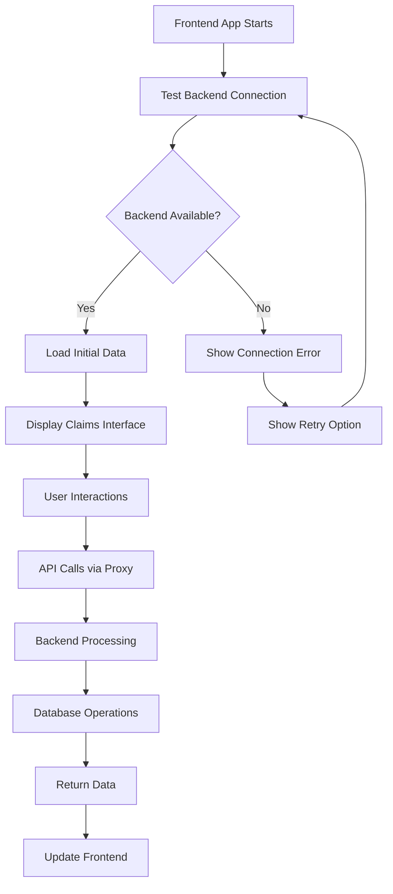

# Frontend-Backend Connection Guide

This document provides comprehensive information about the connection between the Angular frontend and Spring Boot backend in the Claims Management System.

## 🔗 Connection Architecture

```
Frontend (Angular 17+)     Backend (Spring Boot)       Database (PostgreSQL)
http://localhost:4200   ←→  http://localhost:8080   ←→  localhost:5432
```

## 🚀 Quick Connection Test

### Method 1: Run Test Script
```bash
# Windows
test-connection.bat

# The script will test:
# - Backend health endpoint
# - Frontend server
# - API integration
```

### Method 2: Manual Testing

**Test Backend:**
```bash
curl http://localhost:8080/api/health
# Expected: {"status":"UP","timestamp":"...","service":"Claims Backend API"}
```

**Test Frontend:**
```bash
# Navigate to: http://localhost:4200
# Should load the Claims Search UI
```

**Test API Integration:**
```bash
curl http://localhost:8080/api/claims?pageSize=1
# Expected: JSON response with claims data
```

## 🔧 Connection Configuration

### Frontend Proxy Configuration
File: `claims-search-ui/proxy.conf.json`
```json
{
  "/api/*": {
    "target": "http://localhost:8080",
    "secure": false,
    "changeOrigin": true,
    "logLevel": "debug"
  }
}
```

### Backend CORS Configuration
File: `claims-backend/src/main/java/com/claims/controller/*Controller.java`
```java
@CrossOrigin(origins = {"http://localhost:4200", "http://localhost:4201"})
```

### Environment Configuration
File: `claims-search-ui/src/environments/environment.ts`
```typescript
export const environment = {
  production: false,
  apiUrl: '/api'  // Uses proxy to forward to localhost:8080
};
```

## 🛠️ Connection Components

### 1. Connection Test Service
Location: `claims-search-ui/src/app/services/connection-test.ts`

**Methods:**
- `testConnection()`: Tests health endpoint
- `getApiInfo()`: Gets API information
- `testClaimsApi()`: Tests claims endpoint
- `performFullConnectionTest()`: Comprehensive test

### 2. Connection Status Component
Location: `claims-search-ui/src/app/components/connection-status/connection-status.ts`

**Features:**
- Visual connection indicator
- Real-time status updates
- Manual connection testing
- Color-coded status (Green=Connected, Red=Disconnected, Yellow=Testing)

### 3. Health Controller
Location: `claims-backend/src/main/java/com/claims/controller/HealthController.java`

**Endpoints:**
- `GET /api/health`: System health check
- `GET /api/info`: API information

## 📊 API Endpoints

### Health & Information
```
GET /api/health          - System health status
GET /api/info            - API information
```

### Claims API
```
GET /api/claims          - Search claims with filters
GET /api/fetchMyqueue    - Get claims queue (legacy format)
GET /api/claims/{id}     - Get specific claim
POST /api/claims         - Create new claim
GET /api/claims/export   - Export claims data
```

### Dropdown APIs
```
GET /api/claims/statuses       - Get claim statuses
GET /api/claims/loss-states    - Get loss states
GET /api/claims/programs       - Get programs
GET /api/claims/insurance-types - Get insurance types
GET /api/claims/examiners      - Get examiners
GET /api/claims/organizations  - Get organizations
```

### Typeahead APIs
```
GET /api/claims/typeahead/employer?term={term}      - Employer search
GET /api/claims/typeahead/claim-number?term={term}  - Claim number search
GET /api/claims/typeahead/policy-number?term={term} - Policy number search
```

## 🚨 Common Connection Issues & Solutions

### Issue 1: TypeScript Errors
**Error:** `'response.claims' is possibly 'undefined'`

**Solution:** Use safe navigation and fallbacks
```typescript
// ❌ Unsafe
console.log(response.claims[0].claimId);

// ✅ Safe
const claims = response.claims || response.items || [];
if (claims && claims.length > 0) {
  console.log(claims[0].claimId);
}
```

### Issue 2: CORS Errors
**Error:** `Access to XMLHttpRequest... has been blocked by CORS policy`

**Solution:** Verify CORS configuration in backend controllers
```java
@CrossOrigin(origins = {"http://localhost:4200", "http://localhost:4201"})
```

### Issue 3: Proxy Not Working
**Error:** `404 Not Found` for API calls

**Solution:** Ensure proxy configuration and start command
```bash
ng serve --proxy-config proxy.conf.json
```

### Issue 4: Backend Not Running
**Error:** `Connection refused` or `ERR_CONNECTION_REFUSED`

**Solution:** Start backend server
```bash
cd claims-backend
mvn spring-boot:run
```

### Issue 5: Database Connection
**Error:** `Could not connect to PostgreSQL`

**Solution:** 
1. Start PostgreSQL service
2. Create database: `createdb claims_db`
3. Run setup script: `psql -d claims_db -f setup-database.sql`

## 🔍 Debugging Connection Issues

### Frontend Debugging
1. **Open Browser Developer Tools (F12)**
2. **Check Console Tab** for JavaScript errors
3. **Check Network Tab** for API call status
4. **Verify proxy requests** are being forwarded

### Backend Debugging
1. **Check application logs** in terminal
2. **Verify health endpoint** responds: `curl http://localhost:8080/api/health`
3. **Check database connection** in application.properties
4. **Verify CORS configuration** in controllers

### Database Debugging
1. **Test PostgreSQL connection:**
   ```bash
   psql -d claims_db -c "SELECT COUNT(*) FROM claim;"
   ```
2. **Check if data exists:**
   ```sql
   SELECT claim_number, claimant_name FROM claim LIMIT 5;
   ```

## 📝 Connection Status Indicators

### In Claims Search Component
```typescript
// Visual indicators in UI
backendConnected = false;  // Connection status flag
loading = false;           // Loading indicator
```

### In Connection Status Component
```typescript
// Real-time status monitoring
connectionStatus: 'connected' | 'disconnected' | 'testing'
statusMessage: string
```

## 🎯 Best Practices

1. **Always use safe navigation** when accessing API response properties
2. **Implement proper error handling** for all API calls
3. **Use connection indicators** to inform users of status
4. **Test connection** on component initialization
5. **Provide fallback data** when backend is unavailable
6. **Log connection issues** for debugging

## 🔄 Connection Flow



## 📞 Testing Commands

### Complete System Test
```bash
# 1. Start PostgreSQL
# 2. Start Backend
cd claims-backend
mvn spring-boot:run

# 3. Start Frontend (new terminal)
cd claims-search-ui
ng serve --proxy-config proxy.conf.json

# 4. Test Connection
test-connection.bat

# 5. Open Browser
# Navigate to: http://localhost:4200
```

This comprehensive guide should help you identify and resolve any connection issues between your frontend and backend components.